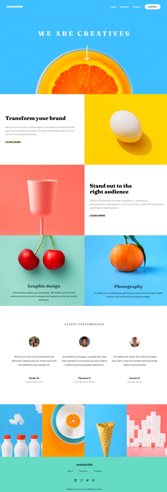

# Frontend Mentor - Sunnyside agency landing page solution

This is a solution to the [Sunnyside agency landing page challenge on Frontend Mentor](https://www.frontendmentor.io/challenges/sunnyside-agency-landing-page-7yVs3B6ef). Frontend Mentor challenges help you improve your coding skills by building realistic projects.

## Table of contents

- [Overview](#overview)
  - [The challenge](#the-challenge)
  - [Screenshot](#screenshot)
  - [Links](#links)
- [My process](#my-process)
  - [Built with](#built-with)
  - [What I learned](#what-i-learned)
  - [Continued development](#continued-development)
  - [Useful resources](#useful-resources)
- [Author](#author)
- [Acknowledgments](#acknowledgments)

## Overview

### The challenge

Users should be able to:

- View the optimal layout for the site depending on their device's screen size
- See hover states for all interactive elements on the page

### Screenshot

#### Desktop Version

### Links

- Solution URL: [Adrian Salitico](https://salproj.tech)
- Live Site URL: [https://frogerall.github.io/sunnyside-landing-page/](https://frogerall.github.io/sunnyside-landing-page/)

## My process

### Built with

- Semantic HTML5 markup
- CSS custom properties
- Flexbox
- CSS Media Query
- CSS Positioning
- Mobile-first workflow

## Author

- Github: https://github.com/Frogerall
- Linkedin: https://www.linkedin.com/in/nairda4/
- Frontend Mentor: https://www.frontendmentor.io/profile/Frogerall
- Dev.to: https://dev.to/frogerall
- Stackoverflow: https://stackoverflow.com/users/20900793/john-adrian-salitico
- Freecodecamp: https://www.freecodecamp.org/Frogerall
- Medium: https://medium.com/@saliticoadrian
- GeekforGeeks:

## Acknowledgments

This is where you can give a hat tip to anyone who helped you out on this project. Perhaps you worked in a team or got some inspiration from someone else's solution. This is the perfect place to give them some credit.
